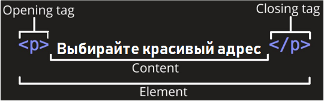

# Основы HTML

## Что такое HTML

HTML (Hypertext Markup Language) - это код, который используется для структурирования и отображения вебстраницы и её
контента. Например, контент (какой-то текст) может быть представлен в виде множества параграфов, маркированных списков
или с использованием изображений и таблиц данных.

Тут будет краткое знакомство с разметкой, так как цель этого руководства только познакомить с ней.
Более подробно уже надо будет смотреть документацию, читать статьи от специалистов в этой теме.

HTML-элементы — основа языка HTML. Каждый HTML-документ состоит из дерева HTML-элементов и текста. Каждый HTML-элемент обозначается начальным (открывающим) и конечным (закрывающим) тегом. Открывающий и закрывающий теги содержат имя элемента.

Все HTML-элементы делятся на пять типов:

1. пустые элементы — `<area>`, `<base>`, `<br>`, `<col>`, `<embed>`, `<hr>`, ``, `<input>`, `<link>`, `<menuitem>`, `<meta>`, `<param>`, `<source>`, `<track>`, `<wbr>`;
2. элементы с неформатированным текстом — `<script>`, `<style>`;
3. элементы, выводящие неформатированный текст — `<textarea>`, `<title>`;
4. элементы из другого пространства имён — MathML и SVG;
5. обычные элементы — все остальные элементы (`<p>text</p>`, `<b>text</b>` и т.д.).


## Примеры HTML элементов

```html
<p>Это параграф</p>

```

### Главными частями нашего элемента являются:

1. **Открывающий тег (Opening tag)**. Состоит из имени элемента (в данном случае, `p`), заключённого в
   открывающие и закрывающие угловые скобки. Открывающий тег указывает, где элемент начинается
   или начинает действовать, в данном случае — где начинается абзац.
2. **Закрывающий тег (Closing tag)**. Это то же самое, что и открывающий тег, за исключением того, что он
   включает в себя косую черту перед именем элемента. Закрывающий элемент указывает, где элемент
   заканчивается, в данном случае — где заканчивается абзац. Отсутствие закрывающего тега является
   одной из наиболее распространённых ошибок начинающих и может приводить к странным
   результатам.
3. **Контент (Content)**. Это контент элемента, который в данном случае является просто текстом.
4. **Элемент(Element)**. Открывающий тег, закрывающий тег и контент вместе составляют элемент.

### Элементы также могут иметь атрибуты, которые выглядят так:

```html
<a href="https://yandex.ru">Яндекс</a>
```

У тегов могут быть какие-либо свойства. Например, у ссылки есть атрибут `href` со значением `https://yandex.ru` в кавычках.


### Атрибут всегда должен иметь:

1. пробел между ним и именем элемента (или предыдущим атрибутом, если элемент уже имеет один или несколько атрибутов);
2. имя атрибута, за которым следует знак равенства;
3. значение атрибута, заключённое с двух сторон в кавычки.

## Вложенные элементы

Вы также можете располагать элементы внутри других элементов — это называется вложением. Если мы хотим заявить, что наша кошка очень раздражена, мы можем заключить слово "очень" в элемент `<strong>` , который указывает, что слово должно быть сильно акцентированно:

```html
<p>Это слово выделено<strong>жирным</strong> шрифтом</p>
```

Будет выглядеть в браузере так:

> Это слово выделено **жирным** шрифтом

## Пустые элементы

Некоторые элементы не имеют контента, и называются пустыми элементами.

```html

```

Он содержит два атрибута, но не имеет закрывающего тега `</img>`, и никакого внутреннего контента. Это потому, что элемент изображения не оборачивает контент для влияния на него. Его целью является вставка изображения в HTML страницу в нужном месте.

## Анатомия HTML документа

Мы завершили изучение основ отдельных HTML элементов, но они не очень полезны сами по себе. Теперь посмотрим, как
отдельные элементы объединяются в целую HTML страницу.

Давайте откроем текстовый файл `demo-1.html`:

```html
<!DOCTYPE html>
<html>
<head>

    <meta charset="utf-8">
    <title>Моя тестовая страница</title>

</head>
<body>


</body>
</html>
```

Здесь мы имеем:

* `!DOCTYPE html` — доктайп. В прошлом, когда HTML был молод (около 1991/1992), доктайпы должны были выступать в качестве ссылки на набор правил, которым HTML страница должна была следовать, чтобы считаться хорошим HTML, что могло означать автоматическую проверку ошибок и другие полезные вещи. Однако в наши дни, никто не заботится об этом, и они на самом деле просто исторический артефакт, который должен быть включён для того, что бы все работало правильно. На данный момент это все, что вам нужно знать.
* `html` — Этот элемент оборачивает весь контент на всей странице, и иногда известен как корневой элемент.
* `head` — Этот элемент выступает в качестве контейнера для всего, что вы пожелаете включить на HTML страницу, но не являющегося контентом, который вы показываете пользователям вашей страницы. К ним относятся такие вещи, как ключевые слова и описание страницы, которые будут появляться в результатах поиска, CSS стили нашего контента, кодировка и многое другое.
* `body` —  В нем содержится весь контент, который вы хотите показывать пользователям, когда они посещают вашу страницу, будь то текст, изображения, видео, игры, проигрываемые аудиодорожки или что-то ещё.
* `meta charset="utf-8"` — этот элемент устанавливает UTF-8 кодировку вашего документа, которая включает в себя большинство символов из всех известных человечеству языков. По сути, теперь документ может обрабатывать любой текстовый контент, который вы в него вложите. Нет причин не устанавливать её, так как это может помочь избежать некоторых проблем в дальнейшем.
* `title` —  Этот элемент устанавливает заголовок для вашей страницы, который является названием, появляющимся на вкладке браузера загружаемой страницы, и используется для описания страницы, когда вы добавляете её в закладки/избранное.

Можно открыть документ demo-1.html в браузере и посмотреть, как он выглядит.

## Изображения

Давайте снова обратим наше внимание на элемент изображения:

```html

```

Как было сказано раньше, код встраивает изображение на нашу страницу в нужном месте. Это делается с
помощью атрибута `src` (source, источник), который содержит путь к нашему файлу изображения. Путь может
быть указан ссылкой на любую картинку из Интернета как в нашем случае или связывать файл, находящийся
на вашем диске. 

Мы также включили атрибут `alt` (alternative, альтернатива). В этом атрибуте, вы указываете поясняющий текст
для пользователей, которые не могут увидеть изображение, возможно, по следующим причинам:

1. У них присутствуют нарушения зрения. Пользователи со значительным нарушением зрения часто
   используют инструменты, называемые Screen Readers (экранные дикторы), которые читают для них
   альтернативный текст.
2. Что-то пошло не так, в результате чего изображение не отобразилось.

Альтернативный текст - это "пояснительный текст". Он должен предоставить читателю достаточно
информации, чтобы иметь представление о том, что передаёт изображение. В этом примере наш текст "Моё
тестовое изображение" не годится. Намного лучшей альтернативой для нашей картинки будет "gif with a cat".

## Заголовки

Элементы заголовка позволяют указывать определённые части контента в качестве заголовков или
подзаголовков. Точно так же, как книга имеет название, названия глав и подзаголовков, HTML документ
может содержать то же самое. HTML включает шесть уровней заголовков: `h1`, `h2`, `h3`...

```html
<h1>Мой главный заголовок</h1>
<h2>Мой заголовок верхнего уровня</h2>
<h3>Мой подзаголовок</h3>
<h4>Мой под-подзаголовок</h4>
```

## Абзацы

Как было сказано ранее, элемент p предназначен для абзацев текста; вы будете использовать их регулярно
при разметке текстового контента:

```html
<p>Это одиночный абзац</p>
```

## Списки

Большая часть веб-контента является списками и HTML имеет специальные элементы для них. Разметка
списка всегда состоит по меньшей мере из двух элементов. Наиболее распространёнными типами списков
являются нумерованные и ненумерованные списки:

1. *Ненумерованные списки* - это списки, где порядок пунктов не имеет значения, как в списке
   покупок. Они оборачиваются в элемент `ul`.
2. *Нумерованные списки* - это списки, где порядок пунктов имеет значение, как в рецепте. Они
   оборачиваются в элемент `ol`.

Каждый пункт внутри списков располагается внутри элемента `li` (list item, элемент списка).
Например, если мы хотим включить часть следующего фрагмента абзаца в список:

```html
<p>Купить в магазине:</p>
<ul>
    <li>Чай</li>
    <li>Кофе</li>
    <li>Сахар</li>
</ul>
<p>Занести домой.</p>
```

## Ссылки

Ссылки очень важны — это то, что делает Интернет Интернетом. Чтобы добавить ссылку, нам нужно
использовать простой элемент — `a` — a это сокращение от "anchor" ("якорь"). Чтобы текст в вашем абзаце
стал ссылкой, выполните следующие действия:

1. Выберите текст.
2. Обернем текст в элемент a, например так:

```html
<a>Текст ссылки</a>
```

3. Зададим элементу a атрибут `href`, например так:

```html
<a href="">Текст ссылки</a>
```

4. Заполним значение этого атрибута веб-адресом, на который хотим указать ссылку:

```html
<a href="https://yandex.ru">Текст ссылки</a>
```

Это была вводная краткая часть о html. В нём гораздо больше элементов, чем тут перечислено, это выйдет на целую книгу.

Дополнительно про HTML вы можете прочитать тут:

[developer.mozilla.org](https://developer.mozilla.org/ru/docs/Learn/Getting_started_with_the_web/HTML_basics)
[html5css.ru](https://html5css.ru/html/default.php)
[html5book.ru](https://html5book.ru/html-html5/)
