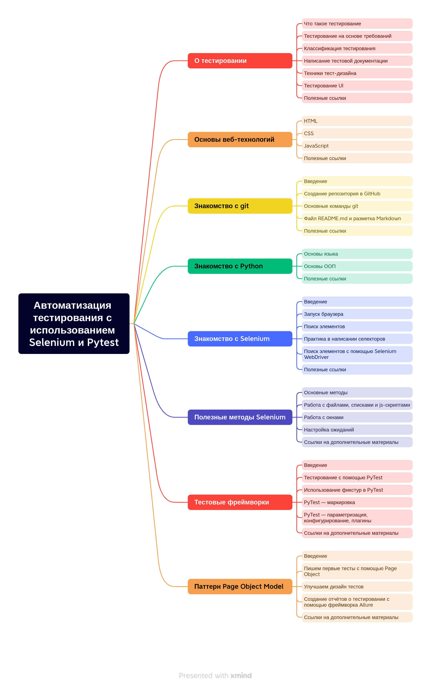

 Geekbrains 

Факультет "Инженер по тестированию цифровые профессии"

---

# 
<strong> Автоматизация тестирования UI с использованием Selenium </strong>

  
  

<strong> Дипломная работа </strong>

 специальности "Инженер по тестированию ПО" 

 Проскурин А.В. 

  
  

 Белгород 2023 

---

## Структура диплома

---

## Введение

### Актуальность

Автоматизация проникает во все сферы деятельности человека, избавляет от рутин и тестирование ПО не исключение.
Автоматизация позволяет разгрузить тестировщика от рутинных проверок во время ретеста и регрессивного тестирования. А
также для повышения качества разрабатываемого продукта путем встраивания в цикл непрерывной интеграции и непрерывной
доставки. Актуальность темы дипломной работы связана со значительным распространением автоматизации тестирования и языка
программирования Python и заключается в необходимости разработки рекомендаций по изучению данного направления для
начинающих и практикующих специалистов по обеспечению качества.

### Цели и задачи

*Цель*

Уменьшить порог вхождения начинающего специалиста в тестировании ПО на языке программирования Python.
Это позволит снять часть нагрузки по обучению у более старших коллег (не отвлекать их от объяснения каких-то базовых процессов).
Даст базовые представления о процессе тестирования.

*Задачи:*

* разобраться что же из себя представляет тестирование;
* ознакомиться с основными web-технологиями;
* пройтись по системе GIT;
* освоить базовые знания по языку программирования Python;
* освоить основные возможности Selenium;
* ознакомиться с тестированием с помощью фреймворков;
* пройтись по паттерну Page Object Model;
* освоить методы формирования отчетов о тестировании.

### Объект и предмет исследования

Объектом этого проекта является самостоятельное изучение базового представления тестирования на языке Python.
Предметом является свободно распространяемая информация в интернете.

### Научная и практическая значимость

Основная значимость это сконцетрированные базовые знания в одном месте, что позволит ускорить процесс обучения начинающего специалиста.

## Рекомендации по изучению

Это небольшой курс, который позволит начать делать первые шаги по тестированию на языке программирования Python.
Проходить его лучше последовательно, но если стажёр знает какую-то из освещенных в нём тем, её можно пропустить и перейти к следующей.
В этих темах будут затронуты только основы.
Дальнейшее углубленное изучение уже ложиться на любознательность джуниора и помощь его старших коллег.
В процессе будут даваться ссылки на сторонние источники, рекомендуется с ними ознакомиться, не пропускать.
